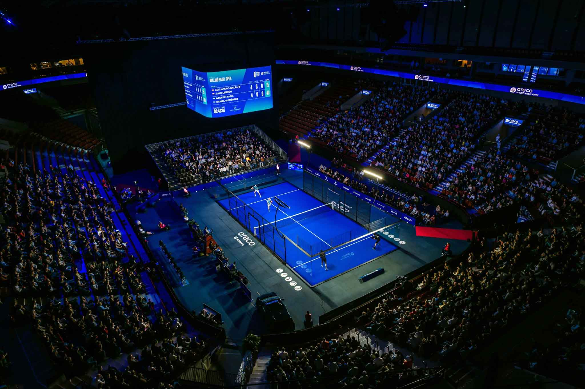

<div align="center">
  

  # 🎾 PADEL SAMU

  **Gestiona tus partidas. Domina la pista.**

  [](https://ikerodeg.github.io/padelSamu/)
  [](https://developer.mozilla.org/en-US/docs/Web/Guide/HTML/HTML5)
  [](https://developer.mozilla.org/en-US/docs/Web/CSS)
  [](https://developer.mozilla.org/en-US/docs/Web/JavaScript)
  
  

  <p align="center">
    <a href="#-sobre-el-proyecto">Sobre el Proyecto</a> •
    <a href="#-características">Características</a> •
    <a href="#-demo">Demo</a> •
    <a href="#-instalación">Instalación</a> •
    <a href="#-roadmap">Roadmap</a>
  </p>
</div>

---

## 🚀 Sobre el Proyecto

**PadelSamu** es una aplicación web moderna para la gestión integral de partidos de pádel amateur. Construida con tecnologías web puras, ofrece una experiencia premium y fluida tanto en dispositivos móviles como de escritorio.

La aplicación permite crear y gestionar partidos de pádel, organizar jugadores, mantener rankings dinámicos y centralizar toda la información deportiva en un solo lugar. Diseñada con un enfoque **mobile-first**, es perfecta para organizar partidos en cualquier momento y lugar.

### 🎯 **¿Qué hace único a PadelSamu?**
- ✅ **Sin dependencias externas** - Funciona offline y es completamente independiente
- ✅ **Experiencia móvil nativa** - Optimizada para smartphones y tablets
- ✅ **Sistema inteligente** - Gestión automática de estados y validaciones
- ✅ **Persistencia local** - Tus datos se mantienen entre sesiones

<div align="center">
  
</div>

## ✨ Características

### 🎾 Creación de Partidas Inteligente
- **Formulario dinámico** con validación en tiempo real
- **Numeración automática** persistente de partidos
- **Horarios realistas** (08:00 - 22:00 cada 30 minutos)
- **Estados inteligentes**: Partidas "completas" o "abiertas"
- **Selección de jugadores** sin duplicados
- **Guardado automático** en localStorage

### 👥 Gestión de Jugadores
- **Base de datos integrada** con 16 jugadores profesionales
- **Sistema anti-duplicados** en selección de equipos
- **Perfiles completos** con posiciones y estadísticas
- **Búsqueda y filtrado** optimizado

### 🏓 Clubs y Ubicaciones
- **6 clubs disponibles** en la base de datos
- **Selección intuitiva** de pistas y horarios
- **Información detallada** de cada ubicación

### 🎨 Diseño Premium Mobile-First
- **Tema oscuro profesional** con paleta OKLCH
- **Interfaz responsive** adaptada a todos los dispositivos
- **Animaciones sutiles** y transiciones fluidas
- **Accesibilidad completa** con navegación por teclado
- **Sin modales** - experiencia mobile-friendly

### 💾 Persistencia y Estado
- **Sistema de cache inteligente** para datos críticos
- **Sesión de usuario persistente** entre visitas
- **Contador de partidos** que sobrevive recargas
- **Estados de aplicación** mantenidos automáticamente

## 🎮 Demo en Vivo

<div align="center">
  <a href="https://ikerodeg.github.io/padelSamu/">
    
  </a>
  <br>
  <strong>👆 Click en la imagen para probar PadelSamu en vivo</strong>
  <br>
  <em>Disponible en GitHub Pages - Funciona en móvil y desktop</em>
</div>

### 📱 **Capturas de Pantalla**
- **Landing Page**: Interfaz principal con navegación intuitiva
- **Crear Partida**: Formulario completo con validaciones inteligentes
- **Estados Dinámicos**: Gestión automática de partidos completos/abiertos

## 🛠 Stack Tecnológico

Construido con **tecnologías web puras** para máxima compatibilidad y performance. Sin frameworks ni dependencias externas.

### 🎨 **Frontend Moderno**
*   **HTML5 Semántico**
    *   Estructura accesible con ARIA labels
    *   Navegación por teclado completa
    *   Meta tags optimizados para SEO

*   **CSS3 Next-Gen**
    *   Variables CSS personalizadas para consistencia
    *   Colores `oklch()` para precisión cromática
    *   Flexbox & Grid para layouts responsive
    *   Media Queries para mobile-first design
    *   Animaciones CSS nativas y transiciones

*   **Vanilla JavaScript (ES6+)**
    *   Módulos ES6 (`import/export`) para arquitectura modular
    *   Async/await para operaciones asíncronas
    *   Destructuring, spread operator, y sintaxis moderna
    *   API del DOM nativa sin librerías externas

### 💾 **Persistencia y Estado**
*   **localStorage API** nativa para persistencia de datos
*   **Sistema de cache inteligente** para optimización de carga
*   **Estados de aplicación** mantenidos automáticamente
*   **Serialización JSON** nativa

### 🏗️ **Arquitectura**
*   **Patrón modular** con separación clara de responsabilidades
*   **Sistema de errores centralizado** (mobile-friendly)
*   **Componentes reutilizables** y funciones puras
*   **Documentación completa** con JSDoc

## ⚡ Instalación y Uso

¡Clona y juega! No necesitas procesos de compilación ni dependencias externas.

### 📥 **Instalación**

1.  **Clona el repositorio**
    ```bash
    git clone https://github.com/ikerodeg/padelSamu.git
    cd padelSamu
    ```

2.  **Ejecuta localmente**
    ```bash
    # Con Python 3
    python3 -m http.server 8000

    # O con Node.js
    npx serve .

    # O con VS Code: Click derecho en index.html → "Open with Live Server"
    ```

3.  **Abre en navegador**
    ```
    http://localhost:8000
    ```

### 🎮 **Primeros Pasos**

1. **Landing Page**: Explora la interfaz principal
2. **Crear Partida**: Haz click en "Crear partida nueva"
3. **Rellena el formulario**: Fecha, hora, club, pista, jugadores
4. **Confirma**: La partida se guarda automáticamente
5. **Repite**: Crea múltiples partidos con numeración automática

### 📱 **Compatible con**
- ✅ Chrome/Chromium (recomendado)
- ✅ Firefox
- ✅ Safari
- ✅ Edge
- ✅ Navegadores móviles (iOS/Android)

## 🗺 Roadmap

### ✅ **Completado (v1.0)**
- [x] **Diseño UI/UX Base** - Interfaz premium mobile-first
- [x] **Sistema de Gestión de Partidas** - Creación completa con validaciones
- [x] **Base de Datos de Jugadores** - 16 perfiles profesionales
- [x] **Sistema de Clubs** - 6 ubicaciones disponibles
- [x] **Numeración Automática** - Contador persistente de partidos
- [x] **Estados Inteligentes** - Partidas completas/abiertas
- [x] **Persistencia localStorage** - Datos mantenidos entre sesiones
- [x] **Sistema de Errores** - Manejo robusto y mobile-friendly
- [x] **Accesibilidad Completa** - ARIA, navegación por teclado
- [x] **Responsive Design** - Optimizado para todos los dispositivos

### 🚧 **Próximas Funcionalidades**
- [ ] **Lista de Partidas** - Visualizar y gestionar partidos existentes
- [ ] **Sistema de Resultados** - Registrar ganadores y estadísticas
- [ ] **Rankings Dinámicos** - Sistema ELO con clasificación
- [ ] **Perfiles de Usuario** - Historial y estadísticas personales
- [ ] **Integración Telegram** - Notificaciones automáticas
- [ ] **PWA Features** - Offline y notificaciones push
- [ ] **API Backend** - Sincronización con servidor

### 🎯 **Mejoras Futuras**
- [ ] **Modo Torneo** - Gestión de competiciones
- [ ] **Estadísticas Avanzadas** - Gráficos y métricas
- [ ] **Modo Oscuro/Claro** - Toggle de temas
- [ ] **Multi-idioma** - Soporte para varios idiomas
- [ ] **Exportación de Datos** - CSV/Excel de estadísticas

---

## 🤝 Contribuciones

¡Las contribuciones son bienvenidas! Si quieres mejorar PadelSamu:

1. **Fork** el proyecto
2. **Crea** una rama para tu feature (`git checkout -b feature/nueva-funcionalidad`)
3. **Commit** tus cambios (`git commit -m 'feat: añade nueva funcionalidad'`)
4. **Push** a la rama (`git push origin feature/nueva-funcionalidad`)
5. **Abre** un Pull Request

### 📋 **Guías de Contribución**
- Sigue los estándares de código ES6+
- Mantén la compatibilidad mobile-first
- Agrega tests para nuevas funcionalidades
- Actualiza la documentación

---

## 📄 Licencia

Este proyecto está bajo la **Licencia MIT** - ver el archivo [LICENSE](LICENSE) para más detalles.

---

## 🙏 Agradecimientos

- **Diseño de UI/UX**: Inspirado en aplicaciones deportivas modernas
- **Tecnologías Web**: Por hacer posible el desarrollo sin dependencias
- **Comunidad Open Source**: Por las herramientas y recursos utilizados

---

<div align="center">
  <p>Desarrollado con ❤️ y 🎾 por <a href="https://github.com/ikerodeg">ikerodeg</a></p>
  <p><em>¡Domina la pista con PadelSamu! 🏓</em></p>
  <p><strong>Season 2025 - v1.0</strong></p>
</div>
